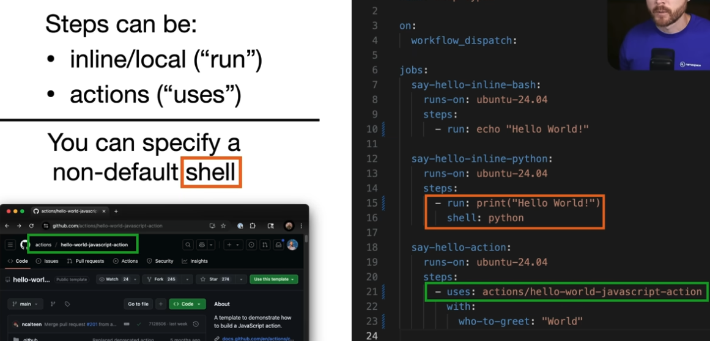
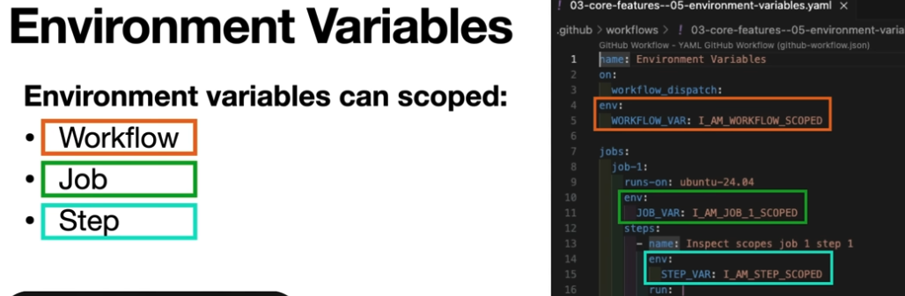
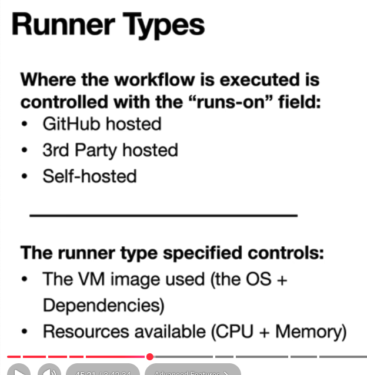

# Github Actions Study Note

### Environment Variables (04/7)

- [env-variables.yaml](.github/workflows/env-variables.yaml)
- [03-core-features--05-environment-variables.yaml](.github/workflows/03-core-features--05-environment-variables.yaml)

#### 🧠 One-line summary

- env: → static variables (defined in YAML)
- `$GITHUB_ENV` → dynamic variables (shared within same job)
- `$GITHUB_OUTPUT` → data passed between jobs
- env > `$GITHUB_OUTPUT` > `$GITHUB_ENV`, `${{ needs.job.outputs.var }}`

#### Q5 (tricky 🔥)

```yaml
steps:
  - run: |
      echo "FOO=bar" >> $GITHUB_ENV
      echo "$FOO"
```

What will this print?

- A. bar
- B. empty
- C. error

#### 👉 What actually happens?

- echo "FOO=bar" >> $GITHUB_ENV
  → sets variable for future steps
- BUT **same step cannot use it yet**
- So: echo "$FOO", 👉 prints empty, ✅ Correct answer, Q5: B (empty)

---

## $GITHUB_ENV vs $GITHUB_OUTPUT (04/07)

- [github-env-demo.yaml](.github/workflows/github-env-demo.yaml)
- [github-output-demo.yaml](.github/workflows/github-output-demo.yaml)
- [03-core-features--06-passing-data.yaml](.github/workflows/03-core-features--06-passing-data.yaml)

#### 🔥 Compare Side-by-Side

| Feature | `$GITHUB_ENV`         | `$GITHUB_OUTPUT`             |
| ------- | --------------------- | ---------------------------- |
| Scope   | Same job only         | Across jobs                  |
| Usage   | `$MY_VAR`             | `${{ needs.job.outputs.x }}` |
| Set by  | `echo >> $GITHUB_ENV` | `echo >> $GITHUB_OUTPUT`     |

### 1 — Environment Variables (env-variables.yml)

### 2 — Multiple Jobs with needs: (multi-jobs.yml)

### 3 — Conditional Steps with if: (conditional-steps.yml)

### 4 — Marketplace Actions (setup-node.yml)

---

YouTube

### 03-core-features--02-step-types.yaml

- https://youtu.be/Xwpi0ITkL3U?t=1648
- 1- Bash script
- 2-Python script
- 3-JavaScript script



---

#### 04

---

### 03-core-features--05-environment-variables.yaml

- https://youtu.be/Xwpi0ITkL3U?t=2193
- Workflow var: available in any of other different steps.
- Job var: available only in Job1.
- Step var: only available in Job1 and Step1.



---

## GitHub Marketplace

- a library of pre-built, reusable actions
- Think of it like an npm registry, but for GitHub Actions workflows.
- with `uses:`
- `owner/action-name@version`
- `with:`
- https://github.com/marketplace/actions/setup-node-js-environment
- https://github.com/marketplace/actions/checkout

## Certification

- https://ghcertified.com/practice_tests/
- https://medium.com/@kittipat_1413/github-actions-certification-exam-complete-review-and-study-tips-208c70ab7a8f

Exam Details
Format: Roughly 75 multiple-choice and multiple-selection questions.
Duration: 120 minutes.
Cost: Approximately $99 USD, though prices vary by region.
Passing Score: Typically 70%.
Delivery: Proctored online via Pearson VUE or at physical testing centers.
Validity: The certification is valid for **3 year**s

## Syntax

- https://docs.github.com/en/actions/reference/workflows-and-actions/workflow-syntax

- **on**: Defines events that trigger the workflow (e.g., push, pull_request, workflow_dispatch)
- **jobs**: Groups jobs.
  - `<job_id>`: Unique job name (e.g., build, test).
  - **runs-on**: Specifies the runner (e.g., ubuntu-latest).
  - **steps**: List of tasks in the job:
    - **run**: Executes a command-line script.
    - **uses**: Calls a reusable GitHub Action. (e.g., actions/checkout@v4)

```yml
on: push # Required: What triggers it
jobs: # Required: Container for jobs
  my-job: # Required: Job identifier
    runs-on: ubuntu-latest # Required: Where it runs
    steps: # Required: List of tasks
      - run: echo "Hello World" # One of 'run' or 'uses' is required per step
```

## Add Your Secrets

Repository Secret
https://shadhujan.medium.com/how-to-keep-supabase-free-tier-projects-active-d60fd4a17263

Settings -> Secrets and variables -> Actions -> Repository secrets -> New repository secret

- SUPABASE_URL
- SUPABASE_KEY

```bash
curl -X GET "${{ secrets.SUPABASE_URL }}/rest/v1/your_table_name?select=id&limit=1" \
-H "apikey: ${{ secrets.SUPABASE_KEY }}" \
-H "Authorization: Bearer ${{ secrets.SUPABASE_KEY }}"
```

## Review - YouTube

## Runner Types (4/5)

- GitHub hosted
- 3rd Party hosted
- Self-hosted
- VM image
- https://docs.github.com/en/actions/concepts/runners/github-hosted-runners
- 
- [03-core-features--02-step-types.yaml](https://github.com/hirokoymj/devops-directive-github-actions-course/blob/main/.github/workflows/03-core-features--02-step-types.yaml)
