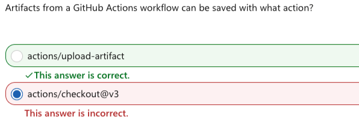

# Github Actions Study Note

## Environment Variables (04/7)

- [env-variables.yaml](.github/workflows/env-variables.yaml)
- [03-core-features--05-environment-variables.yaml](.github/workflows/03-core-features--05-environment-variables.yaml)

#### 🧠 One-line summary

- env: → static variables (defined in YAML)
- `$GITHUB_ENV` → dynamic variables (shared within same job)
- `$GITHUB_OUTPUT` → data passed between jobs
- env > `$GITHUB_OUTPUT` > `$GITHUB_ENV`, `${{ needs.job.outputs.var }}`

#### Q5 (tricky 🔥)

```yaml
steps:
  - run: |
      echo "FOO=bar" >> $GITHUB_ENV
      echo "$FOO"
```

What will this print?

- A. bar
- B. empty
- C. error

#### 👉 What actually happens?

- echo "FOO=bar" >> $GITHUB_ENV
  → sets variable for future steps
- BUT **same step cannot use it yet**
- So: echo "$FOO", 👉 prints empty, ✅ Correct answer, Q5: B (empty)

---

## $GITHUB_ENV vs $GITHUB_OUTPUT (04/07)

- [github-env-demo.yaml](.github/workflows/github-env-demo.yaml)
- [github-output-demo.yaml](.github/workflows/github-output-demo.yaml)
- [03-core-features--06-passing-data.yaml](.github/workflows/03-core-features--06-passing-data.yaml)

#### 🔥 Compare Side-by-Side

| Feature | `$GITHUB_ENV`         | `$GITHUB_OUTPUT`             |
| ------- | --------------------- | ---------------------------- |
| Scope   | Same job only         | Across jobs                  |
| Usage   | `$MY_VAR`             | `${{ needs.job.outputs.x }}` |
| Set by  | `echo >> $GITHUB_ENV` | `echo >> $GITHUB_OUTPUT`     |

## Marketplace Actions

- [setup-node.yaml](.github/workflows/setup-node.yaml)
- [quickstart.yaml](.github/workflows/quickstart.yaml)
- uses: → use a pre-built action
- actions/checkout@v5 → 👉 Downloads (clones) your GitHub repository into the runner
- actions/setup-node@v5 → 👉 Installs Node.js on the runner

### 💡 Why you need it

- Before this step: The runner is just an empty machine
- After this step: Your code is available in:`${{ github.workspace }}`

That’s why your next step works:

```yaml
- run: ls ${{ github.workspace }}
```



---

## Hello World with Bash/Python/JavaScript (4/7)

- [03-core-features--02-step-types.yaml](.github/workflows/03-core-features--02-step-types.yaml)
- Bash script, Python, JavaScript
- https://github.com/actions/hello-world-javascript-action?tab=readme-ov-file#inputs
- `who-to-greet` 👉 an input parameter (like a function argument) for the action.
- Default=="World" (who-to-greet, World, The name of the person to greet)

```yaml
- uses: actions/hello-world-javascript-action # v1.1
  with:
    who-to-greet: 'Hiroko'
```

```yaml
- uses: actions/setup-node@v5
  with:
    node-version: 20 #👉 node-version is also just an input.
```


## Multiple Jobs with needs

- [03-core-features--03-workflows-jobs-steps.yaml](.github/workflows/03-core-features--03-workflows-jobs-steps.yaml)
- [multi-jobs.yaml](.github/workflows/multi-jobs.yaml)

---

## Matrix

- [](.github/workflows/matrix-build.yaml)

```yaml
matrix:
  os: [ubuntu, windows]
  node-version: [18, 20]
```

- ubuntu + 18
- ubuntu + 20
- windows + 18
- windows + 20

### 3 — Conditional Steps with if: (conditional-steps.yml)

---

YouTube

---

## Certification

- https://ghcertified.com/practice_tests/
- https://medium.com/@kittipat_1413/github-actions-certification-exam-complete-review-and-study-tips-208c70ab7a8f

**Exam Details**

- Format: Roughly 75 multiple-choice and multiple-selection questions.
- Duration: 120 minutes.
- Cost: Approximately $99 USD, though prices vary by region.
- Passing Score: Typically 70%.
- Delivery: Proctored online via Pearson VUE or at physical testing centers.
- Validity: The certification is valid for **3 year**s
