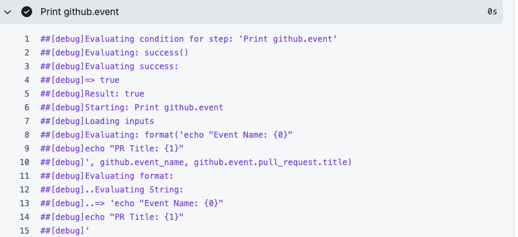
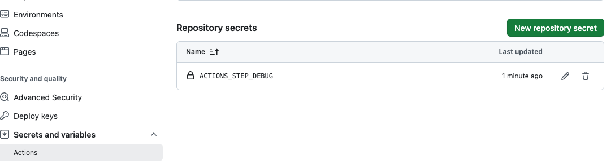

## Practice Exam 101-110

https://ghcertified.com/questions/actions/

---

Q101: How do you ensure that Upload Failure test report step is executed only if Run Tests step fails?

```yaml
##============================================
## 1 ✅
- name: Run Tests
  id: run-tests
  run: npm run test

- name: Upload Failure test report
  if: always() && steps.run-tests.outcome == 'failure' ✅
  run: actions/upload-artifact@v3
  with:
    name: test-report
    path: test-reports.html

##============================================
## 2
- name: Run Tests
  id: run-tests
  run: npm run test

- name: Upload Failure test report
  if: steps.run-tests.outcome == 'failure' ❌
  run: actions/upload-artifact@v3
  with:
    name: test-report
    path: test-reports.html
##============================================
##3
- name: Run Tests
  id: run-tests
  run: npm run test

- name: Upload Failure test report
  if: failure() && steps.run-tests.outcome == 'failure' ❌
  run: actions/upload-artifact@v3
  with:
    name: test-report
    path: test-reports.html
##============================================
## 4 ❌
- name: Run Tests
  id: run-tests
  run: npm run test

- name: Upload Failure test report
  run: actions/upload-artifact@v3
  with:
    name: test-report
    path: test-reports.html
```

💡 [doc](https://docs.github.com/en/actions/learn-github-actions/expressions#status-check-functions)

✅ Correct answer: `if: always() && steps.run-tests.outcome == 'failure'`

💡 Why Option 1 is correct

- By default, steps after a failure are skipped
- always() ensures the step still runs even if the previous step failed
- steps.run-tests.outcome == 'failure' ensures it runs only when tests failed

👉 So Option 1 guarantees:

- ✔ Runs after failure
- ✔ Only runs when the test step failed

🧠 🎯 Core Rule (memorize this)

- Need to run AFTER a failure → use always()
- Need to CHECK if something failed → use failure()

---

### Q102: Which context holds information about the event that triggered a workflow run?

- github.event ✅
- github.job
- `jobs.<job_id>`.result
- github.repository

💡 [doc](https://docs.github.com/en/actions/using-workflows/triggering-a-workflow#using-event-information)

✅ Correct answer: 👉 github.event

```yaml
## 👉 Accesses the PR title from the event
steps:
  - run: echo "${{ github.event.pull_request.title }}"
```

---

### Q103: In GitHub Actions, if you define both branches and paths filter, what is the effect on the workflow execution?

- the workflow will only run when both branches and paths are satisfied ✅
- the workflow will not run when both branches and paths are satisfied
- the workflow will run when either branches or paths are satisfied, but will only apply the matching filter
- the workflow will run when either branches or paths are satisfied

💡 [doc](https://docs.github.com/en/actions/using-workflows/workflow-syntax-for-github-actions#onpull_requestpull_request_targetbranchesbranches-ignore)

✅ Correct answer: 👉 the workflow will only run when both branches and paths are satisfied

```yaml
on:
  push:
    branches:
      - main
    paths:
      - 'src/**'
```

---

### Q104: What is the recommended practice for treating environment variables in GitHub Actions, regardless of the operating system and shell used?

- ignore case sensitivity as GitHub Actions handles it automatically
- treat environment variables as case-sensitive ✅
- depend on the behavior of the operating system in use
- use only uppercase letters for environment variable names

💡 [doc](https://docs.github.com/en/actions/writing-workflows/choosing-what-your-workflow-does/workflow-commands-for-github-actions#setting-an-environment-variable)

✅ Correct answer: 👉 treat environment variables as case-sensitive

💡 **Why this is important**

- Windows → case-insensitive
- Linux/macOS → case-sensitive

```yaml
env:
  MY_VAR: hello

## Bash
echo $my_var   # ❌ may fail on Linux/macOS
echo $MY_VAR   # ✅ correct
```

---

### Q105: Which of the following statements accurately describes the behavior of workflow jobs referencing an environment's protection rules?

- workflow jobs will fail if protection rules are configured
- workflow jobs won't start until all the environment's protection rules pass ✅
- workflow jobs will start immediately and protection rules are evaluated during execution
- workflow jobs will start if at least one protection rule passes

💡 https://docs.github.com/en/actions/deployment/targeting-different-environments/using-environments-for-deployment

✅ Correct answer: 👉 workflow jobs won't start until all the environment's protection rules pass

- 💡 **Why this is correct**

When a job targets an environment with protection rules (like required reviewers, wait timers, etc.):

- ⏸️ The job is placed in a waiting/pending state
- 🔐 All protection rules must be satisfied
- ▶️ Only then does the job actually start

```yaml
jobs:
  deploy:
    runs-on: ubuntu-latest
    environment: production

#👉 If production requires approval:
#Job pauses ⏸️
#Starts only after approval ✅
```

---

### Q106: What is the purpose of the restore-keys parameter in actions/cache in GitHub Actions?

- specify the location of the cached files
- enable cross-OS cache functionality
- provide alternative keys to use in case of a cache miss
- indicate whether a cache hit occurred

💡 [doc](https://docs.github.com/en/actions/using-workflows/caching-dependencies-to-speed-up-workflows#managing-caches)

✅ Correct answer: 👉 provide alternative keys to use in case of a cache miss

- 💡 **Why this is correct**
- restore-keys acts as a fallback mechanism
- If the exact key is not found, GitHub tries:
- Partial matches using restore-keys

```yaml
- uses: actions/cache@v4
  with:
    path: node_modules
    key: npm-${{ hashFiles('package-lock.json') }}
    restore-keys: |
      npm-

##👉 Behavior:

- Try exact match → npm-<hash>
- If miss → try npm- (partial match)
```

---

### Q107: Which variable would you set to true in order to enable step debug logging?

- ACTIONS_STEP_DEBUG ✅
- ACTIONS_WORKFLOW_DEBUG
- ACTIONS_RUNNER_DEBUG
- ACTIONS_JOB_DEBUG

💡 https://docs.github.com/en/actions/monitoring-and-troubleshooting-workflows/enabling-debug-logging

#### ✅ Correct answer:

```
- ACTIONS_STEP_DEBUG ✅ #Deep step logs
- ACTIONS_WORKFLOW_DEBUG ❌ Not exists
- ACTIONS_RUNNER_DEBUG # Runner execution logs
- ACTIONS_JOB_DEBUG ❌ Not exists
```

#### 💡 Why this is correct

To enable step debug logging, you don't set `ACTIONS_STEP_DEBUG` inside the YAML file. Instead, you set it as a **repository secret** in GitHub UI:

**Settings → Secrets and variables → Actions → New repository secret**

- Name: `ACTIONS_STEP_DEBUG`
- Value: `true`





```yaml
name: Debug Logging Demo
on: push

jobs:
  debug-demo:
    runs-on: ubuntu-latest
    steps:
      - name: Print a message
        run: echo "Hello, Debug!"
```

---

### Q108: Which configuration is appropriate for triggering a workflow to run on webhook events related to check_run actions?

```yaml
#1
on:
check_run:
filter: [requested]

#2
on:
check_run:
types: [rerequested, completed]

#3
on:
check_run:
types: [started]

#4
on:
check_run:
type: [closed]
```

💡 [doc](https://docs.github.com/en/actions/using-workflows/events-that-trigger-workflows#check_run)

✅ Correct answer:

- 💡 **Why this is correct**
- The check_run event supports specific valid activity types, including:
- `created` | `rerequested` | `completed`

```yaml
#1 ❌
on:
check_run:
filter: [requested]

#2 ✅
on:
check_run:
types: [rerequested, completed]

#3 ❌ started is NOT a valid check_run type
on:
check_run:
types: [started]

#4 ❌ Wrong key (type → should be types)
on:
check_run:
typ
```

---

### Q109: What is the purpose of the timeout-minutes keyword in a step?

- it limits the execution time for individual step
- it defines the time interval for individual commands within a step
- it specifies the maximum duration a job is allowed to run
- it sets the timeout for waiting on external events before proceeding to the next step

💡 https://docs.github.com/en/actions/using-workflows/workflow-syntax-for-github-actions#jobsjob_idstepstimeout-minutes

#### ✅ Correct answer: 👉 it limits the execution time for individual step

```
- it limits the execution time for individual step ✅
- it defines the time interval for individual commands within a step
- it specifies the maximum duration a job is allowed to run.  ❌ - job-level timeout-minutes
- it sets the timeout for waiting on external events before proceeding to the next step
```

```yaml
name: Timeout Demo
on: push

jobs:
  build:
    runs-on: ubuntu-latest
    steps:
      - name: Quick step
        timeout-minutes: 5 # ⏱ this step fails if it takes longer than 5 minutes
        run: echo "Hello!"

      - name: Long running step
        timeout-minutes: 10 # ⏱ this step fails if it takes longer than 10 minutes
        run: npm run build
```

| Keyword                                 | Level    | Purpose                                        |
| --------------------------------------- | -------- | ---------------------------------------------- |
| `timeout-minutes` under `steps`         | **Step** | Limits execution time for that individual step |
| `timeout-minutes` under `jobs.<job_id>` | **Job**  | Limits execution time for the entire job       |

```yaml
jobs:
  build:
    timeout-minutes: 30 # ⏱ job level - entire job must finish in 30 min
    runs-on: ubuntu-latest
    steps:
      - name: A step
        timeout-minutes: 5 # ⏱ step level - this step must finish in 5 min
        run: echo "Hello!"
```

---

### Q110: Dave is creating a templated workflow for his organization. Where must Dave store the workflow files and associated metadata files for the templated workflow?

- inside a directory named workflow-templates within a repository named .github✅
- inside a directory named .github/org-templates
- inside a directory named .github/workflow-templates❌
- inside a directory named workflow-templates within the current repository

💡 https://docs.github.com/en/actions/using-workflows/creating-starter-workflows-for-your-organization

✅ Correct answer:

👉 inside a directory named workflow-templates within a repository named .github

- 💡 **Why this is correct**

- For organization starter (templated) workflows, GitHub requires:
- 📁 Special repository: `.github`
- 📁 Inside it: `workflow-templates/`

```
.github/
└── workflow-templates/
    ├── ci.yml
    └── ci.properties.json
```

```
🚨 Exam trick
Starter workflows (org-wide) → .github repo
Regular workflows (repo-specific) → .github/workflows
```
