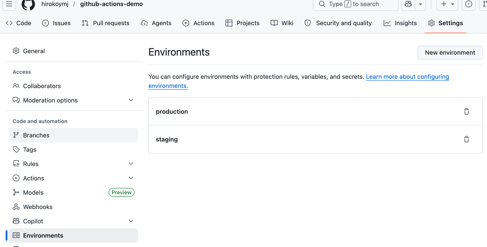

## Practice Exam 121-127

https://ghcertified.com/questions/actions/

---

### Q121: What’s true about default variables? (choose three)

- Default environment variables can be accessed using the env context ✅
- You can add a new default environment variable adding the prefix “GITHUB\_” to it ❌ Not allowed
- Most of the default environment variables have a corresponding context property✅
- Currently, the value of the default CI environment variable can be overwritten, but it's not guaranteed this will always be possible ❌ False for GitHub Actions default vars
- Default environment variables are set by GitHub and not defined in a workflow ✅
- Default environment variables always have the prefix “GITHUB\_”. ❌ Not true for all env vars

💡 https://docs.github.com/en/actions/reference/workflows-and-actions/variables

✅ Correct answers (Choose three):

- Default environment variables can be accessed using the env context
- Most of the default environment variables have a corresponding context property
- Default environment variables are set by GitHub and not defined in a workflow

💡[doc](https://docs.github.com/en/actions/reference/workflows-and-actions/variables)

#### 💡 Why these are correct

#### ✔️ 1. Access via env context

`${{ env.GITHUB_REF }}`

#### ✔️ 2. Many have matching context properties

| Env variable      | Context equivalent  |
| ----------------- | ------------------- |
| GITHUB_REPOSITORY | `github.repository` |
| GITHUB_SHA        | `github.sha`        |

#### ✔️ 3. GitHub-defined, not user-defined

- These variables are automatically provided by GitHub
- You cannot define them manually in workflows

#### ❌ Why the others are wrong

- Add prefix “GITHUB\_” to create new variables → ❌ Not allowed
- CI variable can be overwritten → ❌ False for GitHub Actions default vars
- Always prefix GITHUB\_ → ❌ Not true for all env vars (only GitHub-provided ones follow this pattern)

#### 🧠 Key takeaway

```
Default variables:
✔ Provided by GitHub
✔ Read-only
✔ Often map to github.* context
```

---

Q122: What are the scopes defined for custom variables in a workflow? (choose three)

- A specific environment in the repository, by using environment.`<environment_id>.env` at the top level of the workflow file. ✅
- The entire workflow, by using custom.env at the top level of the workflow file. ❌ custom.env → ❌ Not a valid syntax
- A specific step within a job, by using jobs.`<job_id>.steps[*].env`. ❌ Steps use env, but not in this wildcard forma
- The contents of a job within a workflow, by using jobs.`<job_id>.env`. ✅
- The entire workflow, by using env at the top level of the workflow file. ✅
- All the jobs within a workflow, by using jobs.env. ❌ Not a valid concept in GitHub Actions

💡 [doc](https://docs.github.com/en/actions/learn-github-actions/variables#defining-environment-variables-for-a-single-workflow)

✅ Correct answers (Choose three):

#### Q122 is asking about custom variables (the `vars` context), not `env`: variables. That's why the scopes are different from Q125.

For custom variables, the three valid scopes are:

- Organization level — available across all repos in the org
- Repository level — available across all workflows in the repo
- Environment level — available only when a job targets that specific environment (e.g., production, staging)

````
Why option 1 is confusing: The description says environment.<environment_id>.env "at the top level of the workflow file" — but that's not workflow file syntax. Environment-scoped custom variables are set in GitHub Settings → Environments → Variables, not in the YAML file. The job just needs to reference the environment:```


| Type                           | Where defined                           | How accessed               |
| ------------------------------ | --------------------------------------- | -------------------------- |
| Environment variables (`env:`) | Workflow YAML file                      | `${{ env.VAR }}` or `$VAR` |
| Custom variables (`vars`)      | GitHub repo/org/environment Settings UI | `${{ vars.VAR }}`          |

#### Why option 1 is confusing:

The description says environment.<environment_id>.env "at the top level of the workflow file" — but that's not workflow file syntax. Environment-scoped custom variables are set in GitHub Settings → Environments → Variables

```yaml
jobs:
  deploy:
    runs-on: ubuntu-latest
    environment: production # this unlocks environment-scoped vars
    steps:
      - run: echo ${{ vars.API_URL }} # comes from production environment settings
```



---

Q123: What must be added to actions/checkout if my-org/my-private-repo is a private repository differing from the one containing the current workflow?

```yaml
name: deploy-workflow
on: [push]
jobs:
  my-job:
    runs-on: ubuntu-latest
    steps:
      - name: 'Checkout GitHub Action'
        uses: actions/checkout@v4
        with:
          repository: my-org/my-private-repo
          path: ./.github/actions/my-org/my-private-repo
```

```yaml
# 1. Leave as is since access tokens will be passed automatically
with:
  repository: my-org/my-private-repo
  path: ./.github/actions/my-org/my-private-repo ❌ Wrong → private repo requires explicit token

# 2. Create an input MY_ACCESS_TOKEN
with:
  repository: my-org/my-private-repo
  path: ./.github/actions/my-org/my-private-repo
  token: ${{ MY_ACCESS_TOKEN }} ❌ Not valid syntax

# 3. The environmental variable GITHUB_TOKEN
with:
  repository: my-org/my-private-repo
  path: ./.github/actions/my-org/my-private-repo
  token: $GITHUB_TOKEN ❌ Missing ${{ }} syntax

# 4. Create a GitHub secret MY_ACCESS_TOKEN✅
with:
  repository: my-org/my-private-repo
  path: ./.github/actions/my-org/my-private-repo
  token: ${{ secrets.MY_ACCESS_TOKEN }}
```

💡 https://docs.github.com/en/actions/writing-workflows/workflow-syntax-for-github-actions#example-using-an-action-inside-a-different-private-repository-than-the-workflow

✅ Correct answer: 👉 4. Create a GitHub secret MY_ACCESS_TOKEN

#### 💡 Why this is correct

When checking out a private repository different from the current one, GitHub requires:

- 🔐 `A Personal Access Token (PAT)` or fine-grained token
- Stored securely as a GitHub Secret
- Passed via the token input

```
🧠 Key takeaway
Private repo checkout:
✔ use secrets
✔ use PAT or fine-grained token
✔ pass via token: ${{ secrets.NAME }}
```

```
🚨 Exam trap

If repo is:
same repo → GITHUB_TOKEN often works
different/private repo → must use secrets PAT
```

---

Q124: Given the following configuration, how many jobs will GitHub Actions run when this matrix is evaluated?

```yaml
strategy:
  matrix:
    os: [ubuntu-latest, windows-latest]
    node: [14, 16]
    include:
      - os: macos-latest
        node: 18
      - os: ubuntu-latest
        node: 14
```

- 7 jobs
- 6 jobs
- 5 jobs✅ ## My Answer
- No jobs will run because the syntax is invalid.
- 4 jobs

💡 [doc](https://docs.github.com/en/actions/writing-workflows/choosing-what-your-workflow-does/running-variations-of-jobs-in-a-workflow#expanding-or-adding-matrix-configurations)

✅ Correct answer: 👉 5 jobs

1. ubuntu-latest 14
2. ubuntu-latest 16
3. windows-latest 14
4. windows-latest 16
5. macos-latest 18

---

Q125: At what levels can environment variables be defined ? (Choose three)

- Action level
- Workflow level ✅
- Step level ✅
- Job level ✅

💡 [doc](https://docs.github.com/en/actions/writing-workflows/choosing-what-your-workflow-does/store-information-in-variables)

✅ Correct answers (Choose three):

👉 Workflow level
👉 Job level
👉 Step level

```yaml
name: Env Variable Levels
on: push

env:
  WORKFLOW_VAR: 'I am available everywhere' # Workflow level

jobs:
  example:
    runs-on: ubuntu-latest
    env:
      JOB_VAR: 'I am available in this job only' # Job level
    steps:
      - name: Step with its own variable
        env:
          STEP_VAR: 'I am available in this step only' # Step level
        run: |
          echo $WORKFLOW_VAR
          echo $JOB_VAR
          echo $STEP_VAR
```

---

Q126: How should a dependent job reference the output1 value produced by a job named job1 earlier in the same workflow?

💡 [doc](https://docs.github.com/en/actions/writing-workflows/choosing-what-your-workflow-does/passing-information-between-jobs)

✅ Correct answer: 👉 ${{ needs.job1.outputs.output1 }}

#### 💡 Why this is correct

- To access outputs from another job, you must:

1. Declare a dependency using **needs**
2. Reference outputs via the **needs** context

#### 🧩 Example

```yaml
jobs:
  job1:
    runs-on: ubuntu-latest
    outputs:
      output1: ${{ steps.step1.outputs.result }}
    steps:
      - id: step1
        run: echo "result=hello" >> "$GITHUB_OUTPUT"

  job2:
    runs-on: ubuntu-latest
    needs: job1
    steps:
      - run: echo "${{ needs.job1.outputs.output1 }}"
```

- 👉 job2 can access job1 output via:
- ${{ needs.job1.outputs.output1 }}

---

Q127: Which workflow command syntax correctly sets an environment variable named 'API_VERSION' with the value '2.1' for subsequent steps in a GitHub Actions job?

- echo "API_VERSION=2.1" >> "$GITHUB_OUTPUT" ❌ $GITHUB_OUTPUT is for job outputs (passed to other jobs), not env vars
- set-env name=API_VERSION value=2.1 ❌ old syntax
- export API_VERSION=2.1 >> "$GITHUB_ENV" ❌ Invalid syntax
- echo "API_VERSION=2.1" >> "$GITHUB_ENV" ✅

💡 https://docs.github.com/en/actions/using-workflows/workflow-commands-for-github-actions#setting-an-environment-variable

✅ Correct answer:

👉 echo "API_VERSION=2.1" >> "$GITHUB_ENV"

```yaml
jobs:
  example:
    runs-on: ubuntu-latest
    steps:
      - name: Set env variable
        run: echo "API_VERSION=2.1" >> "$GITHUB_ENV"

      - name: Use env variable in next step
        run: echo "API version is $API_VERSION" # prints 2.1
```

| Option                                       | Verdict    | Reason                                                                        |
| -------------------------------------------- | ---------- | ----------------------------------------------------------------------------- |
| `echo "API_VERSION=2.1" >> "$GITHUB_ENV"`    | ✅ Correct | Proper syntax to set an env var for subsequent steps                          |
| `echo "API_VERSION=2.1" >> "$GITHUB_OUTPUT"` | ❌ Wrong   | `$GITHUB_OUTPUT` is for job **outputs** (passed to other jobs), not env vars  |
| `set-env name=API_VERSION value=2.1`         | ❌ Wrong   | This was the old syntax, now **deprecated and disabled** for security reasons |
| `export API_VERSION=2.1 >> "$GITHUB_ENV"`    | ❌ Wrong   | Invalid syntax — `export` doesn't work with `>>` redirection like this        |
````
