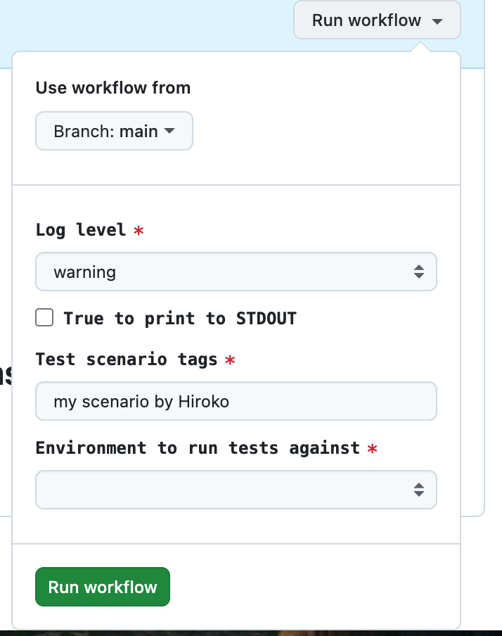
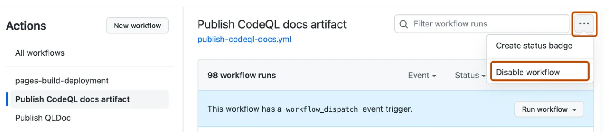

# Practice Test - 21-30

https://ghcertified.com/questions/actions/

---

Q21: What are the possible types of an input variable for a manually triggered workflow? (Select five.)

💡 https://docs.github.com/en/actions/writing-workflows/workflow-syntax-for-github-actions#onworkflow_dispatchinputsinput_idtype

✅ Correct answers (Select five):

👉 boolean
👉 string
👉 choice
👉 environment
👉 number

💡 Answer

- For workflow_dispatch (manual trigger), GitHub supports these input types:
- `on.workflow_dispatch.inputs.<input_id>.type`
- string
- boolean
- choice
- number
- environment (Settings -> Environment)

```yaml
on:
  workflow_dispatch:
    inputs:
      logLevel:
        description: 'Log level'
        required: true
        default: 'warning'
        type: choice # 👈 valid types
        options:
          - info
          - warning
          - debug
      print_tags:
        description: 'True to print to STDOUT'
        required: true
        type: boolean # 👈 valid types
      tags:
        description: 'Test scenario tags'
        required: true
        type: string # 👈 valid types
      environment:
        description: 'Environment to run tests against'
        type: environment # 👈 valid types
        required: true

jobs:
  print-tag:
    runs-on: ubuntu-latest
    if: ${{ inputs.print_tags }}
    steps:
      - name: Print the input tag to STDOUT
        run: echo  The tags are ${{ inputs.tags }}
```



---

Q22: A workflow that has only workflow_dispatch event trigger can be triggered using GitHub's REST API

💡 https://docs.github.com/en/actions/using-workflows/workflow-syntax-for-github-actions#onworkflow_dispatchinputs

✅ Correct answer:👉 True

💡 **GitHub REST API**

- A set of HTTP endpoints that let you interact with GitHub programmatically
- `POST /repos/{owner}/{repo}/actions/workflows/{workflow_id}/dispatches`

```js
curl -X POST \
  -H "Accept: application/vnd.github+json" \
  -H "Authorization: Bearer YOUR_GITHUB_TOKEN" \
  https://api.github.com/repos/hirokoymj/YOUR_REPO_NAME/actions/workflows/deploy.yml/dispatches \
  -d '{"ref":"main", "inputs": {"environment": "production"}}'
```

---

Q23: To stop a workflow from running temporarily without modifying the source code you should

- Delete environment that is required for this workflow
- Remove secrets that are required for this workflow
- Use the Disable workflow option in GitHub Actions ✅
- Prevent any new commits to main branch

💡 https://docs.github.com/en/actions/using-workflows/disabling-and-enabling-a-workflow

✅ Correct answer: 👉 Use the Disable workflow option in GitHub Actions

- `Temporary stop → Disable workflow (UI)`



<hr />

Q24: What are activity types of an event used for ?

- Reacting to new activity on a repository (e.g new contributor)
- Checking if the activity comes from an user or a bot
- Limiting workflow runs to specific activity types using the types filter ✅

💡 https://docs.github.com/en/actions/using-workflows/events-that-trigger-workflows#about-events-that-trigger-workflows

✅ Correct Answer:

- Limiting workflow runs to specific activity types using the types filter
- Example — pull_request event has these activity types:

```yaml
on:
  pull_request:
    types: [opened, synchronize, reopened] #👉
```

| Event         | Activity Types                                 |
| ------------- | ---------------------------------------------- |
| pull_request  | opened, closed, reopened, synchronize, labeled |
| issues        | opened, edited, deleted, labeled, assigned     |
| issue_comment | created, edited, deleted                       |
| release       | published, created, deleted, prereleased       |

---

Q25: You want to create a reusable workflow CI that runs some quality checks, linting and tests on code changes. What event trigger should the CI workflow define to allow reusing it in other workflows?

- workflow_dispatch
- workflow_run
- workflow_trigger
- workflow_call ✅

💡 https://docs.github.com/en/actions/using-workflows/events-that-trigger-workflows

The correct answer is workflow_call

```yaml
# .github/workflows/ci-checks.yml
on:
  workflow_call: # This makes it reusable
    inputs:
      node-version:
        type: string
        default: '18'

jobs:
  lint-and-test:
    runs-on: ubuntu-latest
    steps:
      - uses: actions/checkout@v3
      - name: Run linting
        run: npm run lint
      - name: Run tests
        run: npm test
```

```yaml
# .github/workflows/pull-request.yml
on: [pull_request]

jobs:
  quality-checks:
    uses: ./.github/workflows/ci-checks.yml
    with:
      node-version: '20'
```

---

Q26: A reusable workflow named build creates zip file artifacts. How do you pass the zip file location to the caller workflow that is calling the build workflow? (Select three.)

- You define an output on workflow level in the build workflow
- All outputs are automatically passed to the caller workflows
- In the build workflow you write the output into $GITHUB_OUTPUT in one of the steps
- You define an output on job level in the build workflow

💡 https://docs.github.com/en/actions/using-workflows/reusing-workflows#using-outputs-from-a-reusable-workflow

**Answer**

- ✅ You define an output on workflow level in the build workflow
- ✅ In the build workflow you write the output into $GITHUB_OUTPUT in one of the steps
- ✅ You define an output on job level in the build workflow

- Passing outputs from a reusable workflow requires three chained layers — none can be skipped:
- Step → Job → Workflow
- Here's how they all connect:

```yaml
# build.yml (reusable workflow)
on:
  workflow_call:
    outputs:
      zip-location: # 3️⃣ Workflow-level output
        value: ${{ jobs.build-job.outputs.zip-path }}

jobs:
  build-job:
    runs-on: ubuntu-latest
    outputs:
      zip-path: ${{ steps.zip-step.outputs.zip-path }} # 2️⃣ Job-level output

    steps:
      - name: Create zip
        id: zip-step
        run: |
          zip artifact.zip ./dist
          echo "zip-path=artifact.zip" >> $GITHUB_OUTPUT  # 1️⃣ Step-level output
```

```yaml
# caller.yml
jobs:
  call-build:
    uses: ./.github/workflows/build.yml

  deploy:
    needs: call-build
    steps:
      - run: echo "Zip is at ${{ needs.call-build.outputs.zip-location }}"
```

---

Q27: What are the valid use cases for using defaults? (Select two.)

- Using defaults.run on job level to set default working-directory for all steps in a single job ✅
- Using defaults.env on job level to set default environment variables for all steps in a single job
- Using defaults.run on workflow level to set default shell (e.g bash) for an entire workflow ✅
- Using defaults.env on workflow level to set default environment variables for an entire workflow
- Using defaults.run on step level to set default shell (e.g bash) for that single step

💡 https://docs.github.com/en/actions/using-workflows/workflow-syntax-for-github-actions#defaults

**Answer**

- ✅ Using defaults.run on job level to set default working-directory for all steps in a single job
- ✅ Using defaults.run on workflow level to set default shell (e.g. bash) for an entire workflow

- The key things to understand about `defaults`:
- defaults only supports `defaults.run` — there is no defaults.env. Environment variables are set using the `env` key directly.
- defaults.run supports two settings only:
  - shell — the shell to use (e.g. bash, pwsh)
  - working-directory — the directory to run steps in
- defaults.run is available at two levels only:
  - Workflow level — applies to all jobs and steps in the workflow
  - Job level — applies to all steps within that specific job

```yaml
# Workflow-level default (applies to all jobs)
defaults:
  run:
    shell: bash
    working-directory: ./src

jobs:
  build:
    # Job-level default (overrides workflow-level for this job)
    defaults:
      run:
        working-directory: ./packages/app

    steps:
      - run: npm install # runs in ./packages/app with bash
```

---

**Q28:** How can you ensure that a workflow called Deploy Prod is always running at most one at a time?

- Use concurrency on workflow level ✅
  `concurrency: ${{ github.workflow }}`
- Use queue on workflow level
  `queue: ${{ github.workflow }}`
- Use parallel on workflow level
  `parallel: ${{ github.workflow }}`
- Use order on workflow level
  `order: ${{ github.workflow }}`

💡 https://docs.github.com/en/actions/using-workflows/workflow-syntax-for-github-actions#concurrency

✅ Correct Answer:

- The `concurrency` keyword tells GitHub Actions: "Only one run of this group can be active at a time."
  `${{ github.workflow }}` resolves to the workflow's name — so for "Deploy Prod", it becomes the group name "Deploy Prod", ensuring no two runs of it overlap.

```yaml
name: Deploy Prod

on:
  push:
    branches: [main]

concurrency: ${{ github.workflow }} # ← ensures only 1 run at a time

jobs:
  deploy:
    runs-on: ubuntu-latest
    steps:
      - run: echo "Deploying..."
```

```yaml
concurrency:
  group: ${{ github.workflow }}
  cancel-in-progress: true # cancels the old run in favor of the new one
```

---

Q29: Your Pull Request analysis workflow uses multiple code analysis tools and takes about 20minutes to fully complete. It is triggered on pull_request event with branches filter set to master. Therefore if a developer pushes multiple commits within few minutes multiple workflows are running in parallel. How can you stop all previous workflow runs and only run the one with latest changes?

- Use cancel-in-progress flag for pull_request event

```
on:
 pull_request:
   branches:
     - master
   cancel-in-progress: true
```

- Use activity types filter

```
on:
 pull_request:
   branches:
     - master
   types: [latest]
```

- Use concurrency with cancel-in-progress ✅

```
concurrency:
 group: ${{ github.workflow }}-${{ github.ref }}
 cancel-in-progress: true
```

- Use concurrency

```
concurrency:
 group: ${{ github.ref }}
```

💡 https://docs.github.com/en/actions/using-workflows/workflow-syntax-for-github-actions#example-using-concurrency-to-cancel-any-in-progress-job-or-run

✅ Correct Answer: Use concurrency with cancel-in-progress

- So if a developer pushes 3 commits quickly → runs #1 and #2 get cancelled, only run #3 (the latest) continues. 🎯
- `group: ${{ github.workflow }}-${{ github.ref }}`
  - Groups runs by workflow name + branch. So each PR branch gets its own concurrency group
- `cancel-in-progress: true`:
  - When a new run starts, it automatically cancels any previous run in the same group

```yaml
name: PR Analysis

on:
  pull_request:
    branches:
      - master

concurrency:
  group: ${{ github.workflow }}-${{ github.ref }}
  cancel-in-progress: true

jobs:
  analyze:
    runs-on: ubuntu-latest
    steps:
      - run: echo "Running analysis..."
```

| Variable          | Example Value                |
| ----------------- | ---------------------------- |
| github.workflow   | PR Analysis                  |
| github.ref        | refs/heads/master            |
| github.ref_name   | master                       |
| github.sha        | a1b2c3d4... (commit hash)    |
| github.actor      | hirokoymj (who triggered it) |
| github.event_name | pull_request, push           |
| github.repository | hirokoymj/my-repo            |

---

Q30: When will job3 run?

```yaml
jobs:
  job1:
  job2:
    needs: job1
  job3:
    if: ${{ always() }}
    needs: [job1, job2]
```

- job3 will run after job1 and job2 have completed, regardless of whether they were successful ✅
- You cannot use if: ${{ always() }} and needs together. The workflow will fail on startup.
- job3 will run after job1 and job2 have been successfully completed
- job3 will run after both job1 and job2 have failed

💡 https://docs.github.com/en/actions/using-workflows/workflow-syntax-for-github-actions#example-not-requiring-successful-dependent-jobs

✅ Correct Answer:

- Why `always()` is the key
  By default, if a job in needs fails, all dependent jobs are skipped. The always() function overrides that behavior.

| Scenario              | Without `always()` | With `always()` |
| --------------------- | ------------------ | --------------- |
| job1 ✅, job2 ✅      | job3 runs          | job3 runs       |
| job1 ❌, job2 skipped | job3 skipped       | job3 still runs |
| job1 ✅, job2 ❌      | job3 skipped       | job3 still runs |
