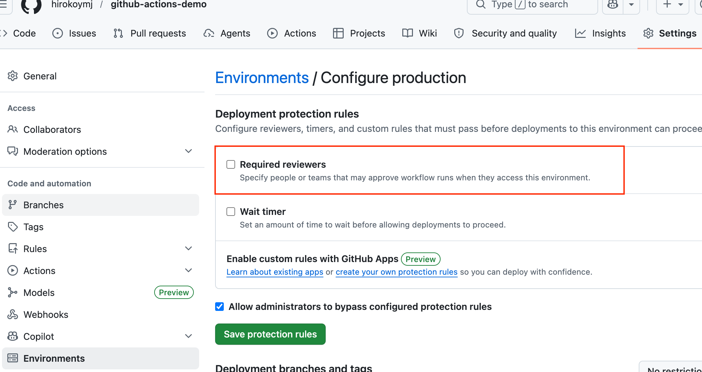
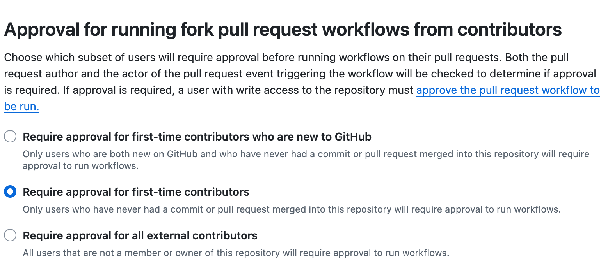

## Practice Exam 51-60

- [Practice Exam 51-60](#practice-exam-51-60)
  - [Q51: What are the three types of Actions?](#q51-what-are-the-three-types-of-actions)
  - [Q52: Is this statement true? Docker container actions are usually slower than JavaScript actions](#q52-is-this-statement-true-docker-container-actions-are-usually-slower-than-javascript-actions)
  - [Q53: When creating a custom GitHub Action you have to store the source code in .github/workflows directory](#q53-when-creating-a-custom-github-action-you-have-to-store-the-source-code-in-githubworkflows-directory)
  - [Q54: When creating custom GitHub Actions - in what file does all the action metadata have to be defined?](#q54-when-creating-custom-github-actions---in-what-file-does-all-the-action-metadata-have-to-be-defined)
  - [Q55: A workflow was initially run on commit A and failed. You fixed the workflow with the subsequent commit B. When you re-run that workflow it will run with code from which commit?](#q55-a-workflow-was-initially-run-on-commit-a-and-failed-you-fixed-the-workflow-with-the-subsequent-commit-b-when-you-re-run-that-workflow-it-will-run-with-code-from-which-commit)
  - [Q56: How can you require manual approvals by a maintainer if the workflow run is targeting the production environment?](#q56-how-can-you-require-manual-approvals-by-a-maintainer-if-the-workflow-run-is-targeting-the-production-environment)
  - [Q57: Which is true about environments?](#q57-which-is-true-about-environments)
  - [Q58: When using GitHub Actions to access resources in one of the cloud providers (such as AWS, Azure or GCP) the safest and recommended way to authenticate is](#q58-when-using-github-actions-to-access-resources-in-one-of-the-cloud-providers-such-as-aws-azure-or-gcp-the-safest-and-recommended-way-to-authenticate-is)
  - [Q59: Your open-source publicly available repository contains a workflow with a pull_request event trigger. How can you require approvals for workflow runs triggered from forks of your repository?](#q59-your-open-source-publicly-available-repository-contains-a-workflow-with-a-pull_request-event-trigger-how-can-you-require-approvals-for-workflow-runs-triggered-from-forks-of-your-repository)
  - [Q60: Which of the following default environment variables contains the name of the person or app that initiated the workflow run?](#q60-which-of-the-following-default-environment-variables-contains-the-name-of-the-person-or-app-that-initiated-the-workflow-run)

### Q51: What are the three types of Actions?

- Docker container actions, JavaScript Actions, Composite Actions
- Docker container Actions, JavaScript Actions, Custom Actions
- Python Actions, JavaScript Actions, Custom Actions
- Docker container actions, Java Actions, Composite Actions

💡 https://docs.github.com/en/actions/creating-actions/about-custom-actions#types-of-actions

✅ Correct Answer:

```
- Docker container actions, JavaScript Actions, Composite Actions ✅
- Docker container Actions, JavaScript Actions, Custom Actions
- Python Actions, JavaScript Actions, Custom Actions
- Docker container actions, Java Actions, Composite Actions
```

- Composite Actions — Let you combine multiple workflow steps (including run shell commands and other actions) into a single reusable action. No Docker or Node.js required.

```yaml
# action.yml
name: 'My Composite Action'
runs:
  using: 'composite'
  steps:
    - name: Run a script
      run: echo "Hello from composite!"
      shell: bash
    - name: Use another action
      uses: actions/checkout@v4
```

---

### Q52: Is this statement true? Docker container actions are usually slower than JavaScript actions

- False
- True

💡 Docker container actions are slower than JavaScript actions

✅ Correct Answer:

```
- False
- True ✅
```

- **JavaScript Actions (faster)**
- Run directly on the runner using Node.js (already installed)
- No container overhead — execution starts immediately

```yml
# Runs instantly on the runner
runs:
  using: 'node20'
  main: 'index.js'
```

- **Docker Container Actions (slower)**
- Must pull/build the Docker image first

```yaml
# Has to pull image + start container first
runs:
  using: 'docker'
  image: 'docker://alpine:3.8'
```

```yaml
jobs:
  compare:
    runs-on: ubuntu-latest
    steps:
      # Faster - JS action, no container needed
      - uses: actions/checkout@v4

      # Slower - Docker action, must pull + start container
      - uses: docker://alpine:3.8
        with:
          args: echo "Hello from Docker"
```

---

### Q53: When creating a custom GitHub Action you have to store the source code in .github/workflows directory

- Only if the action is reusable
- True
- Only for Docker container actions
- False

💡 https://docs.github.com/en/actions/creating-actions/about-custom-actions#choosing-a-location-for-your-action

✅ Correct Answer:

```
- Only if the action is reusable
- True
- Only for Docker container actions
- False ✅
```

- ✅ False — You do NOT have to store custom action source code in .github/workflows.
- **Workflows** → stored in .github/workflows/

```yaml
.github/
workflows/
ci.yml        ← workflow files go here
```

- **Custom Actions** → stored in their own directory or separate repository

```yaml
# Option 1: Same repo, separate directory
my-action/
  action.yml      ← action definition
  index.js        ← action source code

# Option 2: Dedicated public/private repo
my-org/my-action/
  action.yml
  index.js
```

---

### Q54: When creating custom GitHub Actions - in what file does all the action metadata have to be defined?

Metadata examples: name, description, outputs or required inputs

- In the action.yml or action.yaml file in the action repository
- It's edited in GitHub Marketplace UI when published for sharing
- In the repository README file
- In the action.yml or action.yaml file in the action repository, but it is not required if the action is not meant to be shared and used by the public

💡 https://docs.github.com/en/actions/creating-actions/metadata-syntax-for-github-actions

✅ Correct Answer:

```
- In the action.yml or action.yaml file in the action repository ✅
- It's edited in GitHub Marketplace UI when published for sharing
- In the repository README file
- In the action.yml or action.yaml file in the action repository, but it is not required if the action is not meant to be shared and used by the public
```

- ✅ The action.yml or action.yaml file is where all action metadata must be defined.
- This file is always required.

```yaml
# action.yml
name: 'Greet User' # Action name
description: 'Greets a user' # Action description
author: 'hiroko@hirokoymj.com'

inputs:
  username: # Input ID
    description: 'The user to greet'
    required: true
    default: 'World'

outputs:
  greeting: # Output ID
    description: 'The greeting message'

runs:
  using: 'node20'
  main: 'index.js'
```

```js
// index.js
const core = require('@actions/core');

const username = core.getInput('username'); // reads input
const greeting = `Hello, ${username}!`;

core.setOutput('greeting', greeting); // sets output
```

---

### Q55: A workflow was initially run on commit A and failed. You fixed the workflow with the subsequent commit B. When you re-run that workflow it will run with code from which commit?

- It will trigger two workflows, one with code from commit A and one with code from commit B t

- It will run with code from commit A

- It will run with code from commit B

- You cannot re-run workflows in GitHub Actions. You have to trigger a new workflow which will run with latest changes

💡 https://docs.github.com/en/actions/managing-workflow-runs/re-running-workflows-and-jobs#about-re-running-workflows-and-jobs

✅ Correct Answer:

```
- It will trigger two workflows, one with code from commit A and one with code from commit B t ❌
- It will run with code from commit A ✅
- It will run with code from commit B
- You cannot re-run workflows in GitHub Actions. You have to trigger a new workflow which will run with latest changes
```

- When you re-run a workflow, GitHub Actions always uses the same commit SHA and Git ref as the original run — it does not pick up newer commits.

```yaml
# Original run on commit A (failed)
# Re-run still uses commit A's code, not commit B
```

💡 From the docs: "Re-running a workflow uses the same GITHUB_SHA (commit SHA) and GITHUB_REF (Git ref) of the original event that triggered the workflow run."

---

### Q56: How can you require manual approvals by a maintainer if the workflow run is targeting the production environment?

- Using branch protection rules.
- Setting the required reviewers in the production workflow
- Manual approvals are not supported by GitHub Actions
- Using deployment protection rules

💡 https://docs.github.com/en/actions/deployment/targeting-different-environments/using-environments-for-deployment

✅ Correct Answer:

```
- Using branch protection rules ❌.
- Setting the required reviewers in the production workflow. ❌ ❌
- Manual approvals are not supported by GitHub Actions
- Using deployment protection rules✅
```

- Setting the required reviewers in the production workflow. ❌ ==> Why your answer is wrong: There is no "required reviewers" setting inside a workflow file.

```js
Repo Settings → Environments → production
  → Required reviewers: [add maintainer usernames]
  → Wait timer: (optional delay in minutes)
```



2. Reference the environment in your workflow:
   ```yaml
   jobs:
   deploy-production:
     runs-on: ubuntu-latest
     environment: production # ← this triggers the protection rules
     steps:
       - name: Deploy to production
         run: echo "Deploying..."
   ```

---

### Q57: Which is true about environments?

- Each workflow can reference a single environment.
- Each job in a workflow can reference a maximum of two environments.
- Each job in a workflow can reference a single environment.
- Each workflow can reference a maximum of two environments.

💡 https://docs.github.com/en/actions/concepts/workflows-and-actions/deployment-environments

✅ Correct Answer:

```
- Each workflow can reference a single environment.
- Each job in a workflow can reference a maximum of two environments.
- Each job in a workflow can reference a single environment. ✅
- Each workflow can reference a maximum of two environments.
```

- ✅ Each job in a workflow can reference a single environment.
- job-level (not workflow-level)

```yaml
jobs:
  deploy-staging:
    runs-on: ubuntu-latest
    environment: staging # ← one environment per job
    steps:
      - run: echo "Deploying to staging..."

  deploy-production:
    runs-on: ubuntu-latest
    environment: production # ← different job, different environment
    needs: deploy-staging # ← runs after staging succeeds
    steps:
      - run: echo "Deploying to production..."
```

---

### Q58: When using GitHub Actions to access resources in one of the cloud providers (such as AWS, Azure or GCP) the safest and recommended way to authenticate is

- Using OIDC
- Using Vault
- Storing access keys in variables
- Storing access keys in secrets

💡 https://docs.github.com/en/actions/deployment/security-hardening-your-deployments/about-security-hardening-with-openid-connect

✅ Correct Answer:

```
- Using OIDC ✅
- Using Vault
- Storing access keys in variables
- Storing access keys in secrets ❌
```

- Using OIDC (OpenID Connect)✅.

```js
# storing access keys
❌ Long-lived credentials — never expire automatically
❌ Must be manually rotated
❌ Risk of leaking if secrets are accidentally exposed
❌ Over-privileged — same key used for every run
#
GitHub Actions Runner
  → Requests short-lived token from GitHub's OIDC provider
  → Presents token to AWS/Azure/GCP
  → Cloud provider verifies token with GitHub
  → Issues temporary credentials (expire after the job)
  → No static keys stored anywhere!
```

```yaml
jobs:
  deploy:
    runs-on: ubuntu-latest
    permissions:
      id-token: write # ← required for OIDC
      contents: read

    steps:
      - name: Configure AWS credentials via OIDC
        uses: aws-actions/configure-aws-credentials@v4
        with:
          role-to-assume: arn:aws:iam::123456789:role/GitHubActionsRole
          aws-region: us-east-1
          # No access keys needed! ✅

      - name: Deploy
        run: aws s3 sync ./dist s3://my-bucket
```

|        | AWS                                        | GCP                             |
| ------ | ------------------------------------------ | ------------------------------- |
| Action | `aws-actions/configure-aws-credentials@v4` | `google-github-actions/auth@v2` |

**GCP OIDC Example**

```yaml
jobs:
  deploy:
    runs-on: ubuntu-latest
    permissions:
      id-token: write # ← required for OIDC
      contents: read

    steps:
      - name: Configure GCP credentials via OIDC
        uses: google-github-actions/auth@v2
        with:
          workload_identity_provider: projects/123456789/locations/global/workloadIdentityPools/my-pool/providers/my-provider
          service_account: my-service-account@my-project.iam.gserviceaccount.com
          # No access keys needed! ✅

      - name: Deploy
        run: gsutil rsync ./dist gs://my-bucket
```

- `OIDC for Cloud Auth`

> **No stored keys** — GitHub proves its identity to the cloud provider at runtime via a token.

|                     | AWS                                        | GCP                             |
| ------------------- | ------------------------------------------ | ------------------------------- |
| Action              | `aws-actions/configure-aws-credentials@v4` | `google-github-actions/auth@v2` |
| Required permission | `id-token: write`                          | `id-token: write`               |

**Always need:**

```yaml
permissions:
  id-token: write
```

---

### Q59: Your open-source publicly available repository contains a workflow with a pull_request event trigger. How can you require approvals for workflow runs triggered from forks of your repository?

- Setup branch protection rules for the repository
- Setup required approvals for fork runs in the repository
- The workflow will not trigger for forks if using pull_request event. If you want to do that you should use fork_pull_request event trigger with require-approval flag.
- Setup deployment protection rules for the repository

💡 https://docs.github.com/en/actions/managing-workflow-runs/approving-workflow-runs-from-public-forks#about-workflow-runs-from-public-forks

✅ Correct Answer:

```
- Setup branch protection rules for the repository
- Setup required approvals for fork runs in the repository ✅
- The workflow will not trigger for forks if using pull_request event. If you want to do that you should use fork_pull_request event trigger with require-approval flag.
- Setup deployment protection rules for the repository ❌
```

```js
Repo Settings → Actions → General
  → Fork pull request workflows from outside collaborators
    ○ Run workflows automatically
    ● Require approval for first-time contributors     ← default
    ○ Require approval for all outside collaborators
```



### Q60: Which of the following default environment variables contains the name of the person or app that initiated the workflow run?

- GITHUB_ACTOR
- GITHUB_USER
- GITHUB_WORKFLOW
- GITHUB_REPOSITORY

💡 https://docs.github.com/en/actions/reference/environment-variables#default-environment-variables

✅ Correct Answer:

```
- GITHUB_ACTOR ✅
- GITHUB_USER
- GITHUB_WORKFLOW
- GITHUB_REPOSITORY
```

```yaml
jobs:
  show-variables:
    runs-on: ubuntu-latest
    steps:
      - name: Print default environment variables
        run: |
          echo "Actor:      $GITHUB_ACTOR"      # person/app who triggered the run
          echo "Workflow:   $GITHUB_WORKFLOW"   # name of the workflow
          echo "Repository: $GITHUB_REPOSITORY" # owner/repo-name
          # GITHUB_USER does not exist ❌
```

```text
Actor:      hiroko          ← the user who pushed/triggered
Workflow:   CI Pipeline     ← name: field from your workflow YAML
Repository: hiroko/my-app   ← format is owner/repo
```
