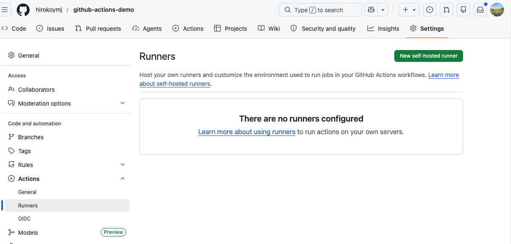
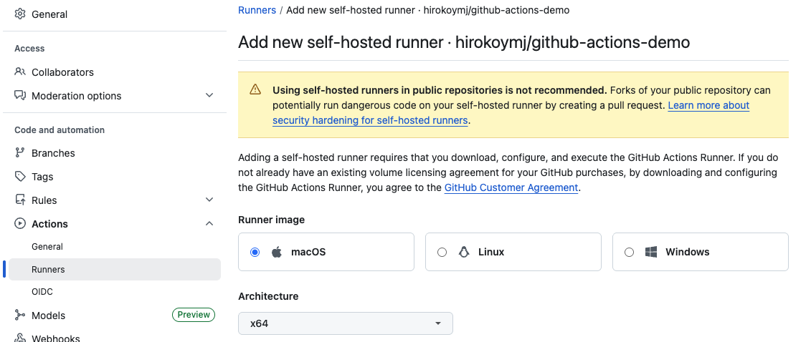

## Practice Exam 61-70

- [Practice Exam 61-70](#practice-exam-61-70)
  - [Q61: Which of the following are default environment variables in GitHub Actions? (Select three.)](#q61-which-of-the-following-are-default-environment-variables-in-github-actions-select-three)
  - [Q62: Your organization defines a secret SomeSecret, however when you reference that secret in a workflow using ${{ secrets.SomeSecret }} it provides a different value than expected. What may be the reason for that?](#q62-your-organization-defines-a-secret-somesecret-however-when-you-reference-that-secret-in-a-workflow-using--secretssomesecret--it-provides-a-different-value-than-expected-what-may-be-the-reason-for-that)
  - [Q63: Which is a correct way to print a debug message?](#q63-which-is-a-correct-way-to-print-a-debug-message)
  - [Q64: How can organizations which are using GitHub Enterprise Server enable automatic syncing of third party GitHub Actions hosted on GitHub.com to their GitHub Enterprise Server instance?](#q64-how-can-organizations-which-are-using-github-enterprise-server-enable-automatic-syncing-of-third-party-github-actions-hosted-on-githubcom-to-their-github-enterprise-server-instance)
  - [Q65: Where can you find network connectivity logs for a GitHub self-hosted-runner?](#q65-where-can-you-find-network-connectivity-logs-for-a-github-self-hosted-runner)
  - [Q66: How can you validate that your GitHub self-hosted-runner can access all required GitHub services?](#q66-how-can-you-validate-that-your-github-self-hosted-runner-can-access-all-required-github-services)
    - [Self-Hosted Runner](#self-hosted-runner)
  - [Q67: Which is the correct way of triggering a job only if configuration variable MY_VAR has the value of MY_VALUE?](#q67-which-is-the-correct-way-of-triggering-a-job-only-if-configuration-variable-my_var-has-the-value-of-my_value)
  - [Q68: To run a step only if the secret MY_SECRET has been set, you can:](#q68-to-run-a-step-only-if-the-secret-my_secret-has-been-set-you-can)
  - [Q69: How can you use the GitHub API to download workflow run logs?](#q69-how-can-you-use-the-github-api-to-download-workflow-run-logs)
  - [Q70: How can you use the GitHub API to create or update a repository secret?](#q70-how-can-you-use-the-github-api-to-create-or-update-a-repository-secret)
    - [Summary](#summary)

### Q61: Which of the following are default environment variables in GitHub Actions? (Select three.)

- GITHUB_ORGANIZATION
- GITHUB_REPOSITORY
- GITHUB_USER
- GITHUB_TOKEN
- GITHUB_WORKFLOW
- GITHUB_ACTOR

💡 https://docs.github.com/en/actions/reference/workflows-and-actions/variables#default-environment-variables

✅ Correct Answer:

```
- GITHUB_ORGANIZATION
- GITHUB_REPOSITORY✅
- GITHUB_USER
- GITHUB_TOKEN✅
- GITHUB_WORKFLOW
- GITHUB_ACTOR✅
```

```yaml
jobs:
  show-variables:
    runs-on: ubuntu-latest
    steps:
      - run: |
          echo $GITHUB_ACTOR        # ✅ "hiroko" - who triggered the run
          echo $GITHUB_REPOSITORY   # ✅ "hiroko/my-app" - owner/repo
          echo $GITHUB_TOKEN        # ✅ auto-generated auth token
          echo $GITHUB_WORKFLOW     # ✅ exists but wasn't a correct answer here
          echo $GITHUB_USER         # ❌ does not exist
          echo $GITHUB_ORGANIZATION # ❌ does not exist
```

---

### Q62: Your organization defines a secret SomeSecret, however when you reference that secret in a workflow using ${{ secrets.SomeSecret }} it provides a different value than expected. What may be the reason for that?

- ${{ secrets.SomeSecret }} expression is only used for repository scoped secrets
- You need to use the GitHub API to access organization scoped secrets
- The secret SomeSecret is also declared in enterprise scope
- The secret SomeSecret is also declared in repository scope

💡 https://docs.github.com/en/actions/security-guides/using-secrets-in-github-actions#naming-your-secrets

✅ Correct Answer:

```
- ${{ secrets.SomeSecret }} expression is only used for repository scoped secrets
- You need to use the GitHub API to access organization scoped secrets
- The secret SomeSecret is also declared in enterprise scope
- The secret SomeSecret is also declared in repository scope ✅
```

- So if the same secret name exists at both organization and repository level, the repository-level value always wins:

```
Organization secret:  SomeSecret = "org-value"
Repository secret:    SomeSecret = "repo-value"  ← this wins

${{ secrets.SomeSecret }} → "repo-value"  😮 not what you expected!
```

---

### Q63: Which is a correct way to print a debug message?

- echo "::debug::Watch out here!"
- echo "Watch out here!" >> $GITHUB_DEBUG
- echo ":debug:Watch out here!"
- echo "::debug::message=Watch out here!"

💡 https://docs.github.com/en/actions/using-workflows/workflow-commands-for-github-actions#example-setting-a-debug-message

✅ Correct Answer:

```
- echo "::debug::Watch out here!" ✅
- echo "Watch out here!" >> $GITHUB_DEBUG
- echo ":debug:Watch out here!"
- echo "::debug::message=Watch out here!"
```

- `echo "::<command>::<message>"`

```yaml
steps:
  - name: All logging levels
    run: |
      echo "::debug::This is a debug message"    # 🔵 hidden by default
      echo "::notice::This is a notice"          # 🔵 shown in job summary
      echo "::warning::This is a warning"        # 🟡 shown in job summary
      echo "::error::This is an error"           # 🔴 shown in job summary
```

---

### Q64: How can organizations which are using GitHub Enterprise Server enable automatic syncing of third party GitHub Actions hosted on GitHub.com to their GitHub Enterprise Server instance?

- GitHub Enterprise Server has access to all GitHub.com Actions by default
- GitHub Enterprise Server cannot use GitHub.com Actions because of it's on-premise nature and no internet access
- Using GitHub Connect
- Using actions-sync tool

💡 https://docs.github.com/en/enterprise-server@3.6/admin/github-actions/managing-access-to-actions-from-githubcom/enabling-automatic-access-to-githubcom-actions-using-github-connect

✅ Correct Answer:

```
- GitHub Enterprise Server has access to all GitHub.com Actions by default
- GitHub Enterprise Server cannot use GitHub.com Actions because of it's on-premise nature and no internet access
- Using GitHub Connect✅
- Using actions-sync tool
```

- The key word in the question is "automatic" — that's what distinguishes the two valid options:

```
GitHub Connect    → automatic syncing  ✅ (correct for this question)
actions-sync tool → manual syncing     ✅ (also valid, but not automatic)
```

> By default, GitHub Actions workflows on GitHub Enterprise Server cannot use actions directly from GitHub.com or GitHub Marketplace. To make all actions from GitHub.com available on your enterprise instance, you can use GitHub Connect to integrate GitHub Enterprise Server with GitHub Enterprise Cloud.

---

### Q65: Where can you find network connectivity logs for a GitHub self-hosted-runner?

- In the job run logs of a job that ran on that Runner
- In the \_diag folder directly on the runner machine
- In the job run logs of a job that ran on that Runner with debug logging enabled
- On GitHub.com on that specific Runner's page

💡 https://docs.github.com/en/actions/hosting-your-own-runners/managing-self-hosted-runners/monitoring-and-troubleshooting-self-hosted-runners#checking-self-hosted-runner-network-connectivity

✅ Correct Answer:

```
- In the job run logs of a job that ran on that Runner
- In the \_diag folder directly on the runner machine ✅
- In the job run logs of a job that ran on that Runner with debug logging enabled ✅❌
- On GitHub.com on that specific Runner's page
```

- In the \_diag folder directly on the runner machine.
  Network connectivity logs live on the runner machine itself, not in GitHub's UI — even with debug logging enabled.

```js
# Linux/macOS
/home/runner/actions-runner/_diag/

# Windows
C:\actions-runner\_diag\
```

```
_diag/
  ├── Runner_<timestamp>.log      # Runner process logs
  ├── Worker_<timestamp>.log      # Job worker logs
  └── pages/
        └── Runner_<timestamp>.log # Network connectivity logs ← here!

# Example _diag log entries
[2024-01-15 10:23:01Z] Connecting to GitHub Actions service...
[2024-01-15 10:23:01Z] DNS resolution: pipelines.actions.githubusercontent.com
[2024-01-15 10:23:02Z] Connection established successfully
[2024-01-15 10:23:02Z] Checking proxy settings...
```

---

### Q66: How can you validate that your GitHub self-hosted-runner can access all required GitHub services?

- Using a GitHub provided script on the runner machine
- By using the predefined GitHub Actions workflow network-connectivity.yml
- By trying to access the runner machine by ssh to validate the network connectivity
- GitHub will validate the network connectivity automatically when the runner application is installed on the runner machine

💡 https://docs.github.com/en/actions/hosting-your-own-runners/managing-self-hosted-runners/monitoring-and-troubleshooting-self-hosted-runners#checking-self-hosted-runner-network-connectivity

✅ Correct Answer:

```
- Using a GitHub provided script on the runner machine ✅
- By using the predefined GitHub Actions workflow network-connectivity.yml
- By trying to access the runner machine by ssh to validate the network connectivity ❌
- GitHub will validate the network connectivity automatically when the runner application is installed on the runner machine
```

#### Self-Hosted Runner

> **Your own machine** that runs GitHub Actions workflows instead of GitHub's servers.

**GitHub-hosted runner** (default)

- GitHub provides and manages the machine
- Spun up fresh every run, then discarded

**Self-hosted runner**

- You provide and manage the machine (your server, VM, or container)
- Stays running, you control the environment

**Why use self-hosted?**

- Need special hardware or software
- Access to private network/internal resources
- Cost savings for heavy usage

```yaml
# GitHub-hosted runner
jobs:
  build:
    runs-on: ubuntu-latest  # ← GitHub manages this machine

# Self-hosted runner
jobs:
  build:
    runs-on: self-hosted  # ← Your own machine
```

- Repo → Settings → Actions → Runners → New self-hosted runner



---



✅ Why the correct answer is:

**“Using a GitHub provided script on the runner machine”**

GitHub provides an `official diagnostic script` specifically designed to test whether your self-hosted runner can reach every required service endpoint (API, Actions service, package registries, etc.).

That script:

- Checks connectivity to `all necessary GitHub domains`
- Verifies `ports and protocols (HTTPS, etc.)`
- Helps identify `firewall / proxy / DNS issues`
- Produces `clear pass/fail results`
- 👉 In short: it’s `purpose-built and comprehensive`, not just a generic network check.

---

### Q67: Which is the correct way of triggering a job only if configuration variable MY_VAR has the value of MY_VALUE?

- It's not possible because configuration variables cannot be used in if conditionals
- It's not possible because configuration variables cannot be used in job level if conditionals
- By creating the following conditional on job level ❌

```yaml
my-job:
  if: ${{ vars.MY_VAR }} == 'MY_VALUE'
```

- By creating the following conditional on job level✅

```yaml
my-job:
  if: ${{ vars.MY_VAR == 'MY_VALUE' }}
```

💡 https://docs.github.com/en/actions/learn-github-actions/contexts#example-usage-of-the-vars-context

✅ Correct Answer:

- The comparison must be inside the ${{ }} expression delimiters — not outside them.

```yaml
jobs:
  my-job:
    if: ${{ vars.MY_VAR == 'MY_VALUE' }}
    runs-on: ubuntu-latest
    steps:
      - run: echo "MY_VAR is MY_VALUE, running this job!"

  other-job:
    if: vars.ENVIRONMENT == 'production'   # also valid — no ${{ }} needed
    runs-on: ubuntu-latest
    steps:
      - run: echo "Deploying to production!"

- ${{ vars.MY_VAR == 'MY_VALUE' }}  ← boolean result  ✅
- ${{ vars.MY_VAR }} == 'MY_VALUE'  ← string + text   ❌
- vars.MY_VAR == 'MY_VALUE'         ← auto-evaluated   ✅
```

---

### Q68: To run a step only if the secret MY_SECRET has been set, you can:

````yaml
#1 - Use the conditional:
if: ${{ secrets.MY_SECRET != '' }}
```

- **Use the conditional:**
```yaml
if: ${{ secrets.MY_SECRET }}


#2
if: ${{ env.MY_SECRET != '' }}

#3
if: ${{ vars.MY_SECRET != '' }}
````

💡 https://docs.github.com/en/actions/using-workflows/workflow-syntax-for-github-actions#example-using-secrets

✅ Correct Answer:

```yaml
#1 - Use the conditional:✅
if: ${{ secrets.MY_SECRET != '' }}
```

```yaml
steps:
  - name: Run only if MY_SECRET is set
    if: ${{ secrets.MY_SECRET != '' }}
    run: echo "Secret is set, running this step!"
```

- Why this works — secrets that haven't been set return an empty string '', so checking != '' tells you whether the secret actually has a value:

---

### Q69: How can you use the GitHub API to download workflow run logs?

- HEAD /repos/{owner}/{repo}/actions/runs/{run_id}/logs
- GET /repos/{owner}/{repo}/actions/runs/{run_id}/logs
- POST /repos/{owner}/{repo}/actions/runs/{run_id}/logs
- PUT /repos/{owner}/{repo}/actions/runs/{run_id}/logs

💡 https://docs.github.com/en/rest/actions/workflow-runs?apiVersion=2022-11-28#download-workflow-run-logs

✅ Correct Answer:

```
- HEAD /repos/{owner}/{repo}/actions/runs/{run_id}/logs
- GET /repos/{owner}/{repo}/actions/runs/{run_id}/logs ✅
- POST /repos/{owner}/{repo}/actions/runs/{run_id}/logs
- PUT /repos/{owner}/{repo}/actions/runs/{run_id}/logs
```

- GET is correct because you're retrieving data — it follows standard REST convention perfectly.

---

### Q70: How can you use the GitHub API to create or update a repository secret?

- HEAD /repos/{owner}/{repo}/actions/secrets/{secret_name}
- GET /repos/{owner}/{repo}/actions/secrets/{secret_name}
- PUT /repos/{owner}/{repo}/actions/secrets/{secret_name}
- POST /repos/{owner}/{repo}/actions/secrets/{secret_name}

💡 https://docs.github.com/en/rest/actions/secrets?create-or-update-a-repository-secret=&apiVersion=2022-11-28#create-or-update-a-repository-secret

✅ Correct Answer:

```
- HEAD /repos/{owner}/{repo}/actions/secrets/{secret_name}
- GET /repos/{owner}/{repo}/actions/secrets/{secret_name}
- PUT /repos/{owner}/{repo}/actions/secrets/{secret_name} ✅
- POST /repos/{owner}/{repo}/actions/secrets/{secret_name} ❌
```

-PUT is correct because it's idempotent — it creates the secret if it doesn't exist, or updates it if it does. This is a classic REST pattern:

```js
# Example using curl
curl -L \
  -X PUT \
  -H "Authorization: Bearer $GITHUB_TOKEN" \
  -H "Accept: application/vnd.github+json" \
  https://api.github.com/repos/hiroko/my-app/actions/secrets/MY_SECRET \
  -d '{"encrypted_value":"encrypted_val","key_id":"key_id"}'
```

#### Summary

- GH hosted runnter - `runs-on: ubuntu-latest  # ← GitHub manages this machine`
- Self-hosted runnter - `runs-on: self-hosted  # ← Your own machine`
- Where is runnter -> Repo → Settings → Actions → Runners → New self-hosted runner
- Repository level: Repo → Settings → Actions → Runners → New self-hosted runner
- Organization level: Org → Settings → Actions → Runners → New self-hosted runner
- Enterprise level: Enterprise → Settings → Actions → Runners → New self-hosted runner
